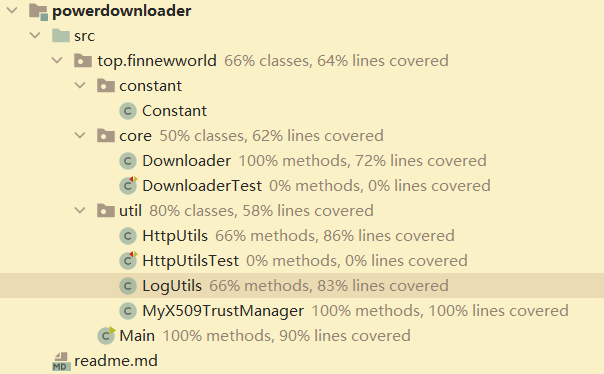

# Simple java multi-thread downloader

## proposal

Build a multi-thread downloader in java for downloading content.

## main dependency

```java
java.net.HttpURLConnection
java.io.BufferedInputStream
junit5
```

## Current Structure



## notes

1. java's command line arguments

   java x.class a b c => args[0] = a

2. Http download logic is same as IO stream,

   ```java
   
   InputStream input = httpUrlConnection.getInputStream();//get stream
   BufferedInputStream bis = new BufferedInputStream(input);
   FileOutputStream fos = new FileOutputStream(httpFileName);
   BufferedOutputStream bos = new BufferedOutputStream(fos);
   ```

3. Support SSL link in connection

   1. Rewrite certification manager to ignore ssl 

      ```java
      import java.security.cert.CertificateException;
      import java.security.cert.X509Certificate;
       
      import javax.net.ssl.X509TrustManager;
       
      public class MyX509TrustManager implements X509TrustManager{
       
         @Override
         public void checkClientTrusted(X509Certificate[] chain, String authType) throws CertificateException {
            // TODO Auto-generated method stub
            
         }
       
         @Override
         public void checkServerTrusted(X509Certificate[] chain, String authType) throws CertificateException {
            // TODO Auto-generated method stub
            
         }
       
         @Override
         public X509Certificate[] getAcceptedIssuers() {
            // TODO Auto-generated method stub
            return null;
         }
       
      }
      ```

   2. connection

      ```java
      import java.io.IOException;
      import java.net.HttpURLConnection;
      import java.net.URL;
      import java.security.KeyManagementException;
      import java.security.NoSuchAlgorithmException;
      import java.security.NoSuchProviderException;
      import java.security.SecureRandom;
      import javax.net.ssl.HostnameVerifier;
      import javax.net.ssl.HttpsURLConnection;
      import javax.net.ssl.SSLContext;
      import javax.net.ssl.SSLSession;
      import javax.net.ssl.TrustManager;
      public static HttpURLConnection getHttpUrlConnection(String url) throws IOException, NoSuchAlgorithmException, NoSuchProviderException, KeyManagementException {
          SSLContext sslcontext = SSLContext.getInstance("SSL");
          TrustManager[] tm = {new MyX509TrustManager()};
          sslcontext.init(null, tm, new SecureRandom());
          HostnameVerifier ignoreHostnameVerifier = new HostnameVerifier() {
              public boolean verify(String s, SSLSession sslsession) {
                  System.out.println("WARNING: Hostname is not matched for cert.");
                  return true;
              }
          };
          HttpsURLConnection.setDefaultHostnameVerifier(ignoreHostnameVerifier);
          HttpsURLConnection.setDefaultSSLSocketFactory(sslcontext.getSocketFactory());
      
      
      	//httpUrlConnection
          URL httpUrl = new URL(url);
          HttpURLConnection httpURLConnection = (HttpURLConnection) httpUrl.openConnection();
          httpURLConnection.setRequestProperty("User-Agent","Mozilla/5.0 (Windows NT 6.1; WOW64) AppleWebKit/535.1 (KHTML, like Gecko) Chrome/14.0.835.163 Safari/535.1");
          return httpURLConnection;
      }
      ```

      

